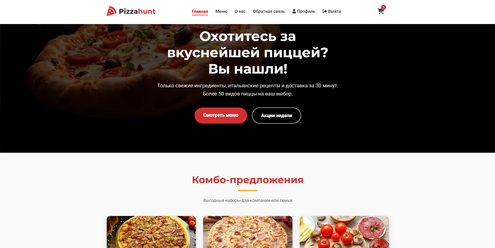
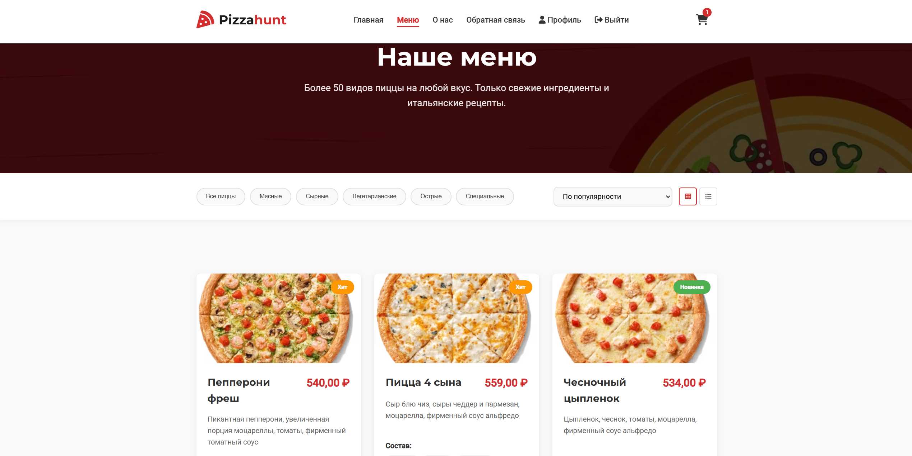

# Pizzahunt - Пиццерия (Учебный проект на Django)
### Информационный сайт пиццерии Pizzahunt с возможностью оформления заказов. 

##  Основные возможности

###  Для пользователей
- Регистрация и авторизация - создание личного кабинета
- Просмотр меню - фильтрация по категориям и сортировка
- Корзина товаров - добавление/удаление пицц, изменение количества
- Оформление заказа - выбор доставки, оплаты, оставление контактов
- История заказов - просмотр всех предыдущих заказов
- Обратная связь - форма для связи с администрацией

###  Для администраторов
- Стандартная Django Admin - полное управление данными
- Кастомная админ-панель - удобная панель
- Статистика продаж - заказы и выручка за день
- Управление контентом - редактирование меню, акций, комбо

## Технологии

Backend:
- Django 
- Python 
- SQLite

Frontend:
- HTML5
- CSS3 
- JavaScript 

### Установка и запуск (Windows)

````
py -m venv venv
venv/scripts/activate
pip install django
pip install pillow
cd pizzahunt
python manage.py runserver
````

````
admin admin - администратор
````
````
test 12345678f - пользователь
````

## Скриншоты

### Главная страница


### Меню пицц


### Обратная связь


### О нас
